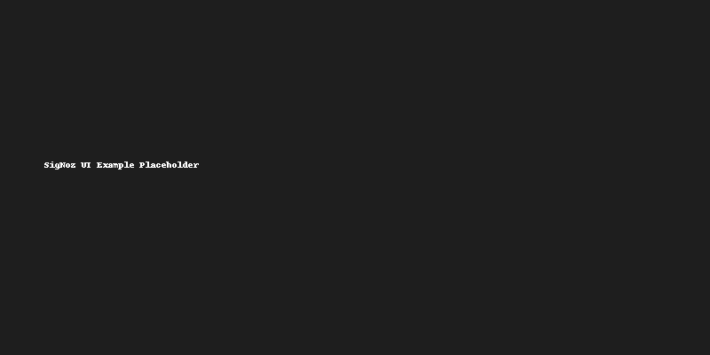

# 📈 From Zero to Observable with OpenTelemetry and SigNoz (Self-Hosted)

> 🚨 For devs at mid-sized teams who’ve faced downtime and now need real observability.

## 🧭 Overview

This guide shows how to take a simple Flask app from “just running” to **fully observable** using [OpenTelemetry](https://opentelemetry.io/) and [SigNoz](https://signoz.io/) (self-hosted).

---

## 🛠️ Prerequisites

- Docker & Docker Compose installed
- Git installed
- Python 3.8+
- Basic terminal skills

...

## 📎 References

- [OpenTelemetry Docs](https://opentelemetry.io/docs/)
- [SigNoz Docs](https://signoz.io/docs/)
- [SigNoz GitHub](https://github.com/SigNoz/signoz)

---